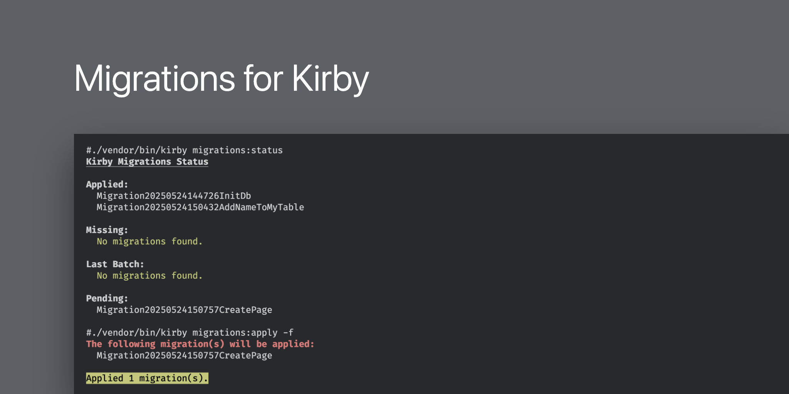

# Kirby Migrations



This plugin provides commands to [Kirby CLI](https://github.com/getkirby/cli) for simple migrations.

Use cases are **database migrations** for your SQL database, **migrating content** or
**creating pages** when deploying your Kirby page. See the [examples](#examples) section for more details.

## Kirby CLI

This plugin uses the [Kirby CLI](https://github.com/getkirby/cli) to run migrations.
Either use it via composer (this plugin will install it for you) or install it globally.

```bash
# not required, but will install the CLI globally
composer global require getkirby/cli
```

If you installed it globally, you can run the migrations via `kirby migrations:apply` otherwise
use `./vendor/bin/kirby migrations:apply`. In the following, we will assume you’re using it via composer.

## Configuration

This plugin provides the following configuration options:

- `thathoff.migrations.dir`: The directory where the migrations are stored. Defaults to a `migrations` folder inside the Kirby `site` directory.
- `thathoff.migrations.stateFile`: The file where the state of the migrations is stored. Defaults to a `.migrations` file inside the `migrations` directory.

## Usage

### Create a New Migration

This will create a new migration file in the `migrations` directory.

```bash
./vendor/bin/kirby migrations:create <name>
```

### Apply All Pending Migrations

This will apply all pending migrations.
When using the `-f` or `--force` flag, it will apply the migrations without
asking for confirmation (eg. for CI/CD pipelines).

```bash
./vendor/bin/kirby migrations:apply [-f|--force]
```

### Show Status

This will show the status of the migrations.

```bash
./vendor/bin/kirby migrations:status
```

### Rollback the Last Batch of Migrations

This will rollback the last batch of migrations.
When using the `-f` or `--force` flag, it will rollback the migrations without asking for confirmation.

```bash
./vendor/bin/kirby migrations:rollback [-f|--force]
```

## Examples

All database examples assume you have a [database configured](https://getkirby.com/docs/guide/database#database-connection) in your `config.php` file.

### Create a Table in a Database


```bash
./vendor/bin/kirby migrations:create InitDb
```

```php
<?php

namespace Thathoff\KirbyMigrations;

use Kirby\Database\Db;

class Migration20250524144726InitDb extends Migration
{
    public function up(): void
    {
        $result = Db::execute("CREATE TABLE `my_table` (
            id int NOT NULL,
            test varchar(255) NOT NULL,
            PRIMARY KEY (id)
        )");

        if (!$result) throw Db::lastError();
    }

    public function down(): void
    {
        $result = Db::execute("DROP TABLE `my_table`");

        if (!$result) throw Db::lastError();
    }
}
```

### Add a New Column to a Table

```bash
./vendor/bin/kirby migrations:create AddNameToMyTable
```

```php
<?php

namespace Thathoff\KirbyMigrations;

use Kirby\Database\Db;

class Migration20250524150432AddNameToMyTable extends Migration
{
    public function up(): void
    {
        $result = Db::execute("ALTER TABLE `my_table` ADD COLUMN `name` varchar(255) NOT NULL");

        if (!$result) throw Db::lastError();
    }

    public function down(): void
    {
        $result = Db::execute("ALTER TABLE `my_table` DROP COLUMN `name`");

        if (!$result) throw Db::lastError();
    }
}
```

### Create a Page in the Content

This is pretty handy when you need to create pages that should not be created manually (eg. container pages)
and only should exist once.

```bash
./vendor/bin/kirby migrations:create CreatePage
```

```php
<?php

namespace Thathoff\KirbyMigrations;

class Migration20250524150757CreatePage extends Migration
{
    public function up(): void
    {
        $content = [
            'title' => 'An interesting title',
            'text'  => 'Some great content here…'
        ];

        // make sure we are allowed to create the page
        $this->kirby->impersonate('kirby');

        $this->kirby->site()->createChild([
            'content'  => $content,
            'slug'     => 'created-by-migration',
            'template' => 'default',
            'isDraft'  => false,
        ]);
    }

    public function down(): void
    {
        // make sure we are allowed to delete the page
        $this->kirby->impersonate('kirby');

        $this->kirby->site()->find('created-by-migration')?->delete();
    }
}
```

## Authors

Maintained and developed by [Markus Denhoff](https://markus.denhoff.com) and [Contributors](https://github.com/thathoff/kirby-migrations/graphs/contributors).

Supported by [reinorange GmbH](https://reinorange.com).
